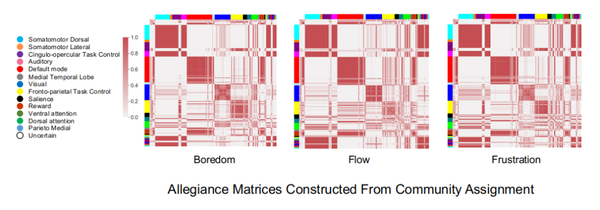
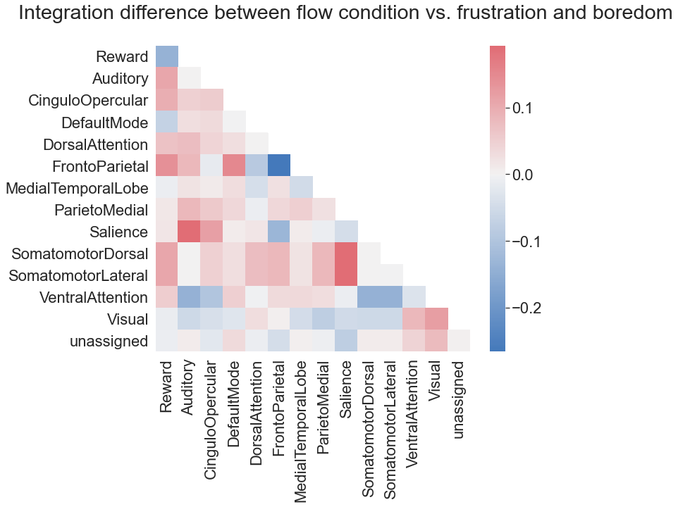

I won **GRADUATE STUDENT AWARD** AT [**CNS21**](https://www.cogneurosociety.org/) 🎉🎉🎉

for the CNS21 submission titled: Fronto-Parietal and Reward Networks are Integrated During the Psychological State of Flow. The research will be presented during the annual meeting of the Cognitive Neuroscience Society, poster C19. 

***

Flow is characterized by high intrinsic reward, high engagement, and high cognitive control during tasks that balance task difficulty with task ability. The Synchronization Theory of Flow hypothesizes that flow is an intrinsically rewarding affective state that is induced by a synchronization between subcortical reward and cognitive control networks. Previous findings provide preliminary support for this hypothesis. However, much of this work has only examined connectivity patterns in these networks while ignoring how the whole-brain network architecture is associated with flow experiences. In a naturalistic fMRI experiment (n = 35), we applied a multi-layer community detection algorithm on a dynamic brain connectivity network to detect nodal module membership. We then calculated integration – the likelihood that nodes of two subnetworks are assigned to the same community – between fronto-partetal control and reward networks. We show that these networks are most integrated in the balanced-difficulty (flow) condition (I = 0.399) compared to low (I = 0.129) and high difficulty (I = 0.152) conditions. Extended exploratory functional cartography analysis (for all the subnetworks) revealed that both the reward network and the fronto-parietal network have the lowest recruitment (estimated likelihood that nodes within the subnetwork are assigned to the same community) as well as highest integration to almost all other sub-networks during the balanced difficulty condition. This result visualizes the brain network synchronization process between reward and control systems during flow. This integrative synchronization between the two networks extends to and engages other sub-networks, which further explains our understanding of the neural basis of flow experiences. Moreover, these results provide novel insights about how intrinsic reward modulates the deployment of cognitive control.

Citation:

Gong, X. & Huskey, R. (March, 2021). Fronto-Parietal and Reward Networks are Integrated During the Psychological State of Flow. Annual Meeting of the Cognitive Neuroscience Society, Virtual Conference.

***

